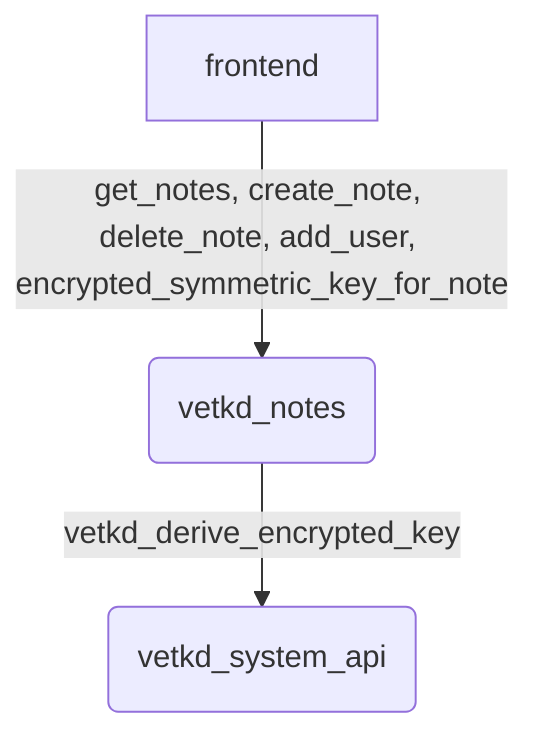

# vetkd-utils

This repo is a monorepo containing a Rust-based cargo crate, an NPM package and sample code (frontend and canister) to make it easier for other developers to use the pre-release version of ICP VetKeys without low-level coding.

# Current deployments

- [vetkeys.shipstone.com](https://vetkeys.shipstone.com)
- [vetkeys2.shipstone.com](https://vetkeys2.shipstone.com)

# Milestone 1 Video

https://youtu.be/UoFhNJdzqNg

# Introduction

The Mini IP Manager is an application that leverages vetKeys from the Internet Computer Protocol (ICP) to securely encrypt and programmatically decrypt and share  IP Docs (AKA notes).  The system ensures that shared content is accessible only under specific conditions set by the creator. Here’s an overview of how it operates:

1. Initialization and Login: The application checks for a stored login (current principal), which is a cryptographically self-signed access identity within the ICP. If no login is found, the user is prompted to log in using Internet Identity.
2. Home Page Functionality: The app continually polls for all notes that the user has permission to read. It lists these notes and retrieves the decryption key (vetKey) necessary to access them. VetKeys are derived from the notes and the owner’s principal, adding a layer of security.
3. Creating IP Documents: Users can create new notes by entering content directly on the page. Saving a note will make it available to share with other users. These documents remain editable until they are shared for the first time.
4. Sharing Documents: Users can share notes with **Everyone** on the system, or they can share with individual app users registered in the Mini IP Manager service. They have the option to set a specific time when the note becomes accessible or allow access at any time by selecting **Anytime**. Shares can be removed until the recipient has accessed the document. Each interaction is recorded in the history log.
5. Accessing Shared Notes: Authorized users can view the note content. Tags, the note’s creator and the history log are not encrypted.

## Key Features and Considerations

**Security.** By using vetKeys derived from unique identifiers and owner principals, the system ensures that only intended recipients can decrypt and access the documents.
 
**Flexibility.** Users control when and with whom their documents are shared, with the ability to set access times and revoke shares if necessary.
 
**Transparency.** The history log provides a transparent record of all interactions related to each note, enhancing accountability.
 
**User Experience.** Continual polling for readable documents ensures users have up-to-date access to new shared content.

# Encrypted notes: vetKD

[View this sample's code on GitHub](https://github.com/dfinity/examples/tree/master/motoko/encrypted-files-dapp-vetkd)

This is  `encrypted-files-dapp-vetkd` [the proposed vetKD feature](https://github.com/dfinity/interface-spec/pull/158) to add sharing of files between users.

In particular, instead of creating a principal-specific AES key and syncing it across devices (using device-specific RSA keys), the notes are encrypted with an AES key that is derived (directly in the browser) from a note-ID-specific vetKey obtained from the backend canister (in encrypted form, using an ephemeral transport key), which itself obtains it from the vetKD system API. This way, there is no need for any device management in the dapp, plus sharing of notes becomes possible.

The vetKey used to encrypt and decrypt a note is note-ID-specific (and not, for example, principal-specific) to enable the sharing of notes between users. The derived AES keys are stored as non-extractable CryptoKeys in an IndexedDB in the browser for efficiency so that their respective vetKey only has to be fetched from the server once. To improve the security even further, the vetKeys' derivation information could be adapted to include a (numeric) epoch that advances each time the list of users with which the note is shared is changed.

Currently, the only way to use this dapp is via manual local deployment (see below).

Please also see the [README of the original encrypted-notes-dapp](../encrypted-notes-dapp/README.md) for further details.

## Disclaimer

This example uses an **insecure** implementation of [the proposed vetKD system API](https://github.com/dfinity/interface-spec/pull/158) in a pre-compiled form via the [vetkd_system_api.wasm](./vetkd_system_api.wasm). **Do not use this in production or for sensitive data**! This example is solely provided **for demonstration purposes** to collect feedback on the mentioned vetKD system API.

## Manual local deployment

### Prerequisites

- [x] Clone the example dapp project: `git clone https://github.com/dfinity/examples`

### Optional Step 0: [Install mise-en-place](https://mise.jdx.dev/getting-started.html)

This is optional, but will correctly setup node and pnpm in all folders which have
.mise.toml, .nvmrc or .tool-versions

```sh
curl https://mise.run | sh
mise install
```

### Step 1: [Install dfx](https://sdk.dfinity.org/docs/quickstart/local-quickstart.html). 

Please keep in mind the `dfx` CLI currently only runs on Linux and macOS.

### Step 2: Install npm packages from the project root:

```sh
pnpm install
```
_Note_: see [Troubleshooting](#troubleshooting) in case of problems.

### Step 3: In case `dfx` was already started before, run the following:

```sh
dfx stop
rm -rf .dfx
```

### Step 4: Run in a separate window:

```sh
dfx start --clean
```
:::info
If you see an error `Failed to set socket of tcp builder to 0.0.0.0:8000`, make sure that the port `8000` is not occupied, e.g., by the previously run Docker command (you might want to stop the Docker daemon whatsoever for this step).
:::

### Step 5: Install a local [Internet Identity (II)](https://wiki.internetcomputer.org/wiki/What_is_Internet_Identity) canister:

:::info 
If you have multiple `dfx` identities set up, ensure you are using the identity you intend to use with the `--identity` flag.
:::
   1. To install and deploy a canister run:
      ```sh
      dfx deploy internet_identity --argument '(null)'
      ```
   2. To print the Internet Identity URL, run:
      ```sh
      pnpm print-dfx-ii
      ```
   3. Visit the URL from above and create at least one local internet identity.

### Step 6: Install the vetKD system API canister:
   1. Ensure the Canister SDK (dfx) uses the canister ID that is hard-coded in the backend canister Rust source code:
      ```sh
      # NOTE: This is the canister ID specified in the source code.
      # for your own deployment you have to create a new one or wait
      # until the final release of the actual system api is finished and released.
      dfx canister create vetkd_system_api --specified-id nn664-2iaaa-aaaao-a3tqq-cai
      ```
   2. Install and deploy the canister:
      ```sh
      dfx deploy vetkd_system_api
      ```

### Step 7:. Deploy the encrypted notes backend canister:

```sh
dfx deploy "vetkd_notes"
```
⚠️ Before deploying the Rust canister, you should first run `rustup target add wasm32-unknown-unknown`.

### Step 8: Update the generated canister interface bindings: 

```sh
dfx generate "vetkd_notes"
```

### Step 9: Deploy the frontend canister:
```sh
dfx deploy vetkd_www
```
You can check its URL with `pnpm print-dfx-www`.


### Step 10: Open the frontend:

   1. Start the local development server, which also supports hot-reloading:
      ```sh
      pnpm dev
      ```
   2. Open the URL that is printed in the console output. Usually, this is [http://localhost:3000/](http://localhost:3000/).

:::info
If you have opened this page previously, please remove all local store data for this page from your web browser, and hard-reload the page. For example in Chrome, go to Inspect → Application → Local Storage → `http://localhost:3000/` → Clear All, and then reload.
:::

## Troubleshooting

If you run into issues, clearing all the application-specific IndexedDBs in the browser (which are used to store Internet Identity information and the derived non-extractable AES keys) might help fix the issue.

## Highlevel Documentation



## States

Use createNote to create a new note owned by your principal. The resulting structure the creation of the note will at first create a low level note using create_note and then derive and download a vetkd to be able to update/encrypt the data and upload it to the backend canister. To make key management easier it will automatically always download and decrypt all documents the current principle has access to as of right now.